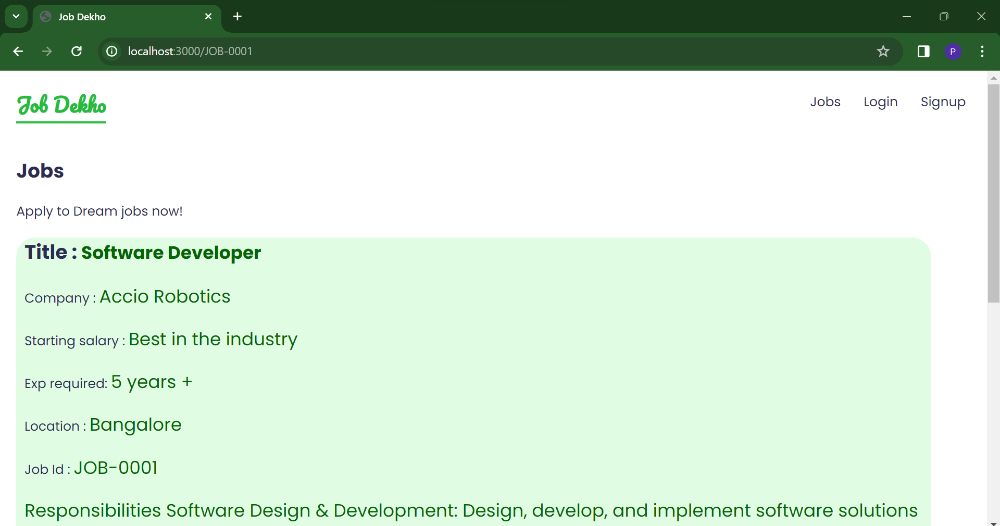

# Job-Dekho-App

A full stack job hunting application

## Frontend

- React

## Backend

- Python
- FastAPI

## DataBase

- MongoDB(Mongo Atlas)

## Features

- Any User/Candidate can view all Jobs in list format
- Any User/Candidate can view each Job details
- Any User/Candidate can SignUp or Login
- Logged In User/Job-seekers can apply any job from Job detail page
- Logged In User/Job-seekers can check list of applied jobs
- Logged In User can logout
- MongoDB table to store all Jobs details
- MongoDB table to store all User/Job-seekers details
- MongoDB table to store all Applied Jobs details

## Steps

- Clone this repository
- Create/Update MongoDB(Mongo Atlas) username, password, cluster, database name and collections in backend/config/database.py file
- Run 'npm run start-dev' command in terminal
